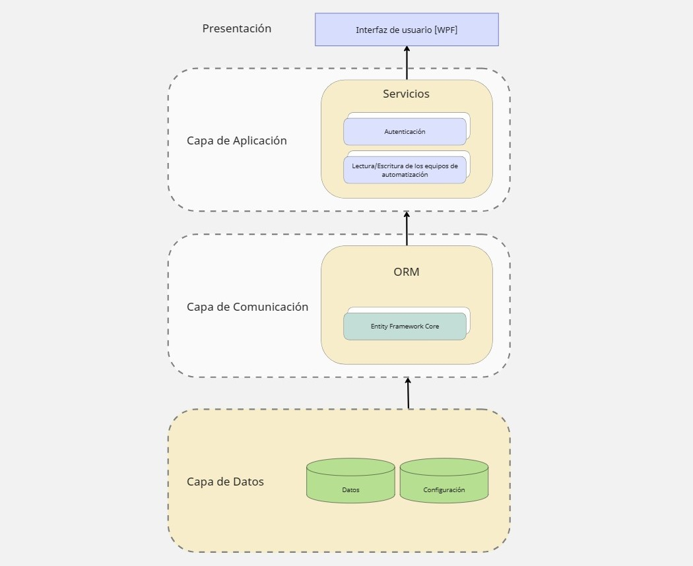
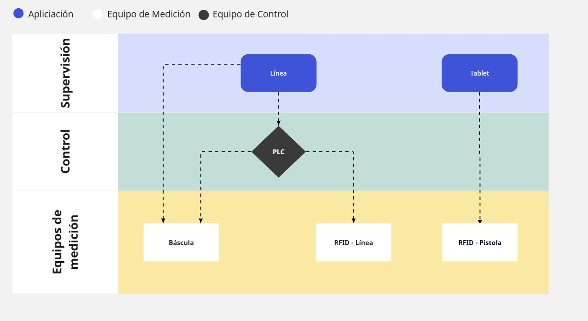

# Documentación del proyecto Havana Club International
-----

El propósito de este informe es documentar los aspectos técnicos referidos a las herramientas utilizadas en la implementación de la aplicación  y   registrar los diferentes diagramas que componen el proceso de la línea de llenado y vaciado de barriles de la empresa Havana Club de La Habana. La aplicación desarrollada por el proveedor Ekinsa, tiene como objetivo principal, captar de forma automática en una base de datos la información asociada al pesaje de las paletas que intervienen en el proceso.

## Dependencias del sistema

### Framework 

- .NetFramework 4.8: Es un entorno de ejecución administrado para Windows que proporciona diversos servicios a las aplicaciones en ejecución. Consta de dos componentes principales: Common Language Runtime (CLR), que es el motor de ejecución que controla las aplicaciones en ejecución, y la biblioteca de clases de .NET Framework, que proporciona una biblioteca de código probado y reutilizable al que pueden llamar los desarrolladores desde sus propias aplicaciones. 

### Bibliotecas de terceros

- DevExpress: Es una herramienta que ofrece a los desarrolladores de aplicaciones una de las suites más completas de componentes de interfaz de usuario (UI) en todas las plataformas. NET tales como Windows Forms, MVC, ASP.NET, Silverlight y Windows XAML.

- Nuget.org: Es el administrador de paquetes para .NET. Permite a los desarrolladores crear, compartir y consumir archivos útiles. Bibliotecas NET. Las herramientas cliente de NuGet brindan la capacidad de producir y consumir estas bibliotecas como "paquetes".

|      Biblioteca       | Versión utilizada |       Proyecto en el que se utiliza       |
|:---------------------:|:-----------------:|:-----------------------------------------:|
|  DbDataReaderMapper   |       1.1.0       |                SQLHandler                 |
|    DevExpress.Wpf     |      22.1.5       |                   Zonas                   |
|        log4net        |      22.0.12      | HavanaApp, PLC, SQLHandler, Zonas, Utiles |
|        MaiKit         |      2.11.1       |                SMTPClient                 |
|        MimeKit        |      2.11.0       |                SMTPClient                 |
|     OxyPlot.Core      |       2.0.0       |                   Zonas                   |
|      OxyPlot.WPF      |       2.0.0       |                   Zonas                   |
| Portable.BouncyCastle |      1.8.10       |                SMTPClient                 |
|       S7netplus       |      0.13.0       |                    PLC                    |
|        Sharp7         |      1.1.75       |                    PLC                    |
| SonarAnalyzer.CSharp  |   8.55.0.65544    |      Lector FEIGCOM, ControlConsola       |
|    BrotliSharpLib     |       0.3.3       |              Lector FEIGCOM               |
|  SqlDataReaderMapper  |       1.0.5       |                SQLHandler                 |

## Herramientas Utilizadas

### Edición y revisión de código

Para la edición e identificación del código se utilizó Visual Studio 2022.
Las principales características de Visual Studio son su multiplataforma, lenguajes de programación, integración con herramientas de desarrollo, depuración avanzada, diseño visual, pruebas automatizadas e integración con la nube.

### Modelado de datos

Para la generación de diagramas se utilizaron herramientas como Altova UModel Enterprise Edition versión 2024, Visual Studio Ultimate 2022, Visual Parading versión web, Draw.io versión colaborativa.

En resumen, el objetivo principal de las herramientas de diseño UML es proporcionar una forma estandarizada y visualmente clara de representar modelos de software, lo que ayuda a los equipos de desarrollo a trabajar en conjunto, acelerar el proceso de desarrollo, reducir errores y diseñar software fácil de entender, mantener y modificar en el futuro.

## Diagramas 

### Diagramas de clases 

El objetivo principal de los diagramas de clase es representar la estructura estática de un sistema orientado a objetos. Estos diagramas muestran las clases que componen el sistema, sus atributos, métodos y las relaciones entre ellas. El objetivo es proporcionar una visión general del sistema y ayudar a los desarrolladores a comprender cómo las diferentes clases interactúan entre sí. Además, los diagramas de clase también pueden ser utilizados para documentar el diseño del sistema y para comunicar ideas entre los miembros del equipo de desarrollo.

#### _Havana App_

#### _Zonas_

#### _Visor_

### Diagramas de flujo

El objetivo principal de los diagramas de flujo es representar gráficamente el flujo de un proceso o procedimiento. Estos diagramas se utilizan para modelar la secuencia de pasos en un proceso, desde el inicio hasta el fin. Los diagramas de flujo permiten identificar los diferentes pasos que se deben seguir en un proceso, así como los posibles caminos alternativos y las decisiones que se deben tomar en cada etapa. Además, los diagramas de flujo también pueden ser utilizados para documentar un proceso y para comunicar ideas entre los miembros del equipo de trabajo. En resumen, el objetivo principal de los diagramas de flujo es proporcionar una vista clara y detallada del proceso y su secuencia de pasos, lo que ayuda a los usuarios a entender cómo funciona el proceso y cómo se deben realizar las diferentes tareas.

#### _Entrada Secuencial_

#### _Salida Secuencial_

#### _Tranfer_

### Diagrama entidad-relación

El objetivo principal de los diagramas entidad-relación (ER) es representar la estructura de datos de un sistema en términos de entidades, atributos y relaciones entre ellas. Estos diagramas son utilizados para modelar la información que se almacena en una base de datos y para definir las reglas de negocio que rigen el comportamiento del sistema. Los diagramas ER permiten identificar las entidades clave en el sistema, así como las relaciones entre ellas, lo que ayuda a los desarrolladores a comprender cómo los datos se relacionan entre sí y cómo se deben almacenar en la base de datos. Además, los diagramas ER también pueden ser utilizados para documentar el diseño del sistema y para comunicar ideas entre los miembros del equipo de desarrollo.

### Diagrama de componentes 

El objetivo principal de los diagramas de componentes es representar la estructura y las relaciones entre los componentes de un sistema. Estos diagramas son utilizados para modelar la arquitectura de software de un sistema y para describir cómo los componentes se comunican entre sí y con otros sistemas. Los diagramas de componentes permiten identificar los diferentes módulos o componentes que conforman el sistema, así como las interfaces y dependencias entre ellos. Además, los diagramas de componentes también pueden ser utilizados para documentar el diseño del sistema y para comunicar ideas entre los miembros del equipo de desarrollo. 
En resumen, el objetivo principal de los diagramas de componentes es proporcionar una vista clara y detallada de la estructura del sistema y sus componentes, lo que ayuda a los desarrolladores a entender cómo funciona el sistema y cómo se deben implementar los diferentes componentes.

### Diagrama de arquitectura  

Es una herramienta para representar la estructura y organización del software, mostrando los componentes que lo conforman y cómo se relacionan entre sí. 

*Objetivos principales:*
- Ayuda a identificar problemas de diseño antes de que se conviertan en problemas mayores en el desarrollo.
- Ayuda a los equipos a tomar decisiones informadas sobre cómo diseñar y desarrollar el software.

### Pirámide de automatización

### Diagrama de casos de uso 

El objetivo principal de los diagramas de casos de uso es representar gráficamente los diferentes actores que interactúan con un sistema y los diferentes escenarios de uso que se pueden presentar. Estos diagramas se utilizan para modelar la funcionalidad del sistema desde el punto de vista del usuario, es decir, para identificar las diferentes tareas que se pueden realizar con el sistema y cómo se relacionan entre sí. Los diagramas de casos de uso permiten definir los requisitos funcionales del sistema y establecer una base para el diseño y la implementación del mismo. Además, los diagramas de casos de uso también pueden ser utilizados para documentar el comportamiento del sistema y para comunicar ideas entre los miembros del equipo de trabajo. 
En resumen, el objetivo principal de los diagramas de casos de uso es proporcionar una vista clara y detallada de la funcionalidad del sistema y cómo se relaciona con los usuarios, lo que ayuda a los usuarios a entender cómo utilizar el sistema y cómo se deben realizar las diferentes tareas.

### Diagramas de secuencia

El objetivo principal de los diagramas de secuencia es representar gráficamente la interacción entre diferentes objetos o componentes de un sistema en un escenario específico de uso. Estos diagramas se utilizan para modelar el comportamiento del sistema desde el punto de vista de los objetos o componentes que participan en una determinada tarea. Los diagramas de secuencia permiten definir la secuencia de eventos que ocurren durante la ejecución de una tarea, incluyendo la interacción entre los objetos o componentes y los mensajes que se intercambian entre ellos. Además, los diagramas de secuencia también pueden ser utilizados para identificar posibles errores o problemas en la interacción entre los objetos o componentes del sistema, lo que ayuda a mejorar la calidad y eficiencia del mismo. 
En resumen, el objetivo principal de los diagramas de secuencia es proporcionar una vista detallada y clara de cómo interactúan los diferentes objetos o componentes de un sistema en un escenario específico de uso, lo que ayuda a entender mejor el comportamiento del sistema y a identificar posibles mejoras o problemas en su diseño y funcionamiento.

#### _Lógica Báscula_

#### _Lógica Consola_

#### _Lógica Zonas_

#### _Lógica PLC_

### Diagrama de actividades

El objetivo principal de los diagramas de actividades es representar gráficamente el flujo de trabajo o procesos de un sistema, mostrando las actividades y acciones que se realizan en un orden secuencial. Estos diagramas se utilizan para modelar el comportamiento del sistema desde una perspectiva de alto nivel, mostrando cómo se llevan a cabo las actividades y cómo se relacionan entre sí. 

Los diagramas de actividades permiten definir la secuencia de acciones que se llevan a cabo en un proceso, incluyendo las decisiones que se toman y las condiciones que deben cumplirse para avanzar en el flujo de trabajo. Además, los diagramas de actividades también pueden ser utilizados para identificar posibles cuellos de botella o problemas en el proceso, lo que ayuda a mejorar la eficiencia y calidad del mismo. 

En resumen, el objetivo principal de los diagramas de actividades es proporcionar una vista detallada y clara del flujo de trabajo o procesos de un sistema, lo que ayuda a entender mejor su funcionamiento y a identificar posibles mejoras o problemas en su diseño y ejecución.

## Documentación técnica

La documentación técnica de un proyecto tiene varios objetivos importantes:

- **Comunicar claramente los detalles técnicos del proyecto:** La documentación técnica es esencial para proporcionar una comprensión clara de los detalles técnicos del proyecto a todos los miembros del equipo, incluyendo desarrolladores, diseñadores, analistas, gerentes de proyecto y otros interesados.

- **Servir como referencia para futuras actualizaciones y mejoras:** La documentación técnica también puede servir como referencia para futuras actualizaciones y mejoras del proyecto. Esto ayuda a garantizar que cualquier cambio futuro se realice de manera consistente con la arquitectura y el diseño existentes.

- **Ayudar en la resolución de problemas:** La documentación técnica también puede ser útil para la resolución de problemas y el mantenimiento del proyecto a largo plazo. Al proporcionar una comprensión clara de la arquitectura y el diseño del sistema, la documentación técnica puede ayudar a identificar rápidamente problemas y solucionarlos de manera eficiente.

- **Proporcionar una guía para el desarrollo y la implementación:** La documentación técnica debe proporcionar una guía detallada para el desarrollo y la implementación del proyecto. Esto incluye descripciones de los requisitos técnicos, la arquitectura del sistema, las herramientas y tecnologías utilizadas, así como cualquier otra información relevante.

### Especificación API

https://qrtix769.github.io/docfx-website/docs/libs/index.html

### Especificación Havana Tablet

https://qrtix769.github.io/docfx-website/docs/tablet/index.html

### Especificación Havana App

https://qrtix769.github.io/docfx-website/docs/linea/index.html
